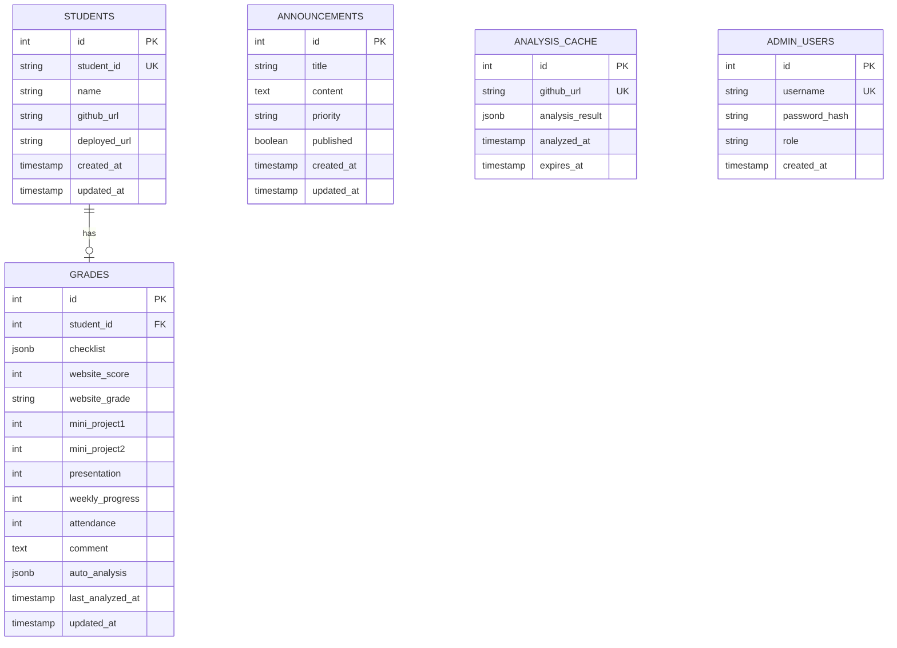

# TDD (Technical Design Document)
# 기술 설계 문서

**프로젝트명**: Vibe Grade - 학생 성적 관리 시스템
**버전**: 1.0
**작성일**: 2025-01-22
**상태**: Draft

---

## 목차
1. [시스템 개요](#1-시스템-개요)
2. [아키텍처 설계](#2-아키텍처-설계)
3. [데이터 모델](#3-데이터-모델)
4. [API 설계](#4-api-설계)
5. [GitHub 자동 분석 알고리즘](#5-github-자동-분석-알고리즘)
6. [프론트엔드 설계](#6-프론트엔드-설계)
7. [백엔드 설계](#7-백엔드-설계)
8. [보안 설계](#8-보안-설계)
9. [배포 전략](#9-배포-전략)
10. [성능 최적화](#10-성능-최적화)

---

## 1. 시스템 개요

### 1.1 시스템 목적
GitHub 리포지토리 자동 분석을 통한 학생 웹사이트 프로젝트 평가 및 성적 관리

### 1.2 주요 기능
- 학생 정보 관리 (CRUD)
- GitHub 리포지토리 자동 분석
- 체크리스트 기반 채점
- 종합 성적 계산 및 통계
- 공지사항 관리
- 데이터 내보내기 (CSV/JSON)

### 1.3 기술 스택 요약
```
Frontend:  React 18 + Vite 5
Backend:   Cloudflare Pages Functions
Database:  Neon PostgreSQL (Serverless)
CDN:       Cloudflare
Domain:    edu.abada.co.kr
```

---

## 2. 아키텍처 설계

### 2.1 High-Level Architecture

```
┌──────────────────────────────────────────────────────────────┐
│                         Users                                │
│          (Professor / Students / Admins)                     │
└────────────────────────┬─────────────────────────────────────┘
                         │
                         │ HTTPS / DNS
                         ▼
┌──────────────────────────────────────────────────────────────┐
│               Cloudflare Global Network                      │
│  ┌────────────────┐  ┌────────────────┐  ┌──────────────┐   │
│  │  DNS Service   │  │   CDN Cache    │  │  DDoS Prot.  │   │
│  └────────────────┘  └────────────────┘  └──────────────┘   │
└────────────────────────┬─────────────────────────────────────┘
                         │
         ┌───────────────┴───────────────┐
         │                               │
         ▼                               ▼
┌─────────────────┐            ┌──────────────────┐
│ Cloudflare Pages│            │  Static Assets   │
│   (React SPA)   │            │  (HTML/CSS/JS)   │
└────────┬────────┘            └──────────────────┘
         │
         │ /api/*
         ▼
┌─────────────────────────────────────────┐
│   Cloudflare Pages Functions            │
│   (Serverless API Endpoints)            │
└──────┬──────────────────┬───────────────┘
       │                  │
       │                  │
       ▼                  ▼
┌──────────────┐   ┌─────────────────┐
│ GitHub API   │   │ Neon PostgreSQL │
│ (Analysis)   │   │   (Database)    │
└──────────────┘   └─────────────────┘
```

---

### 2.2 Component Architecture

#### Frontend Components
```
┌─────────────────────────────────────────┐
│            App.jsx (Root)               │
├─────────────────────────────────────────┤
│  ┌────────────┐  ┌──────────────────┐  │
│  │  Header    │  │  Navigation Tabs │  │
│  └────────────┘  └──────────────────┘  │
│                                         │
│  ┌─────────────────────────────────┐   │
│  │       Active Tab Content        │   │
│  │  ┌──────────────────────────┐   │   │
│  │  │  StudentList Component   │   │   │
│  │  │  - StudentForm           │   │   │
│  │  │  - StudentTable          │   │   │
│  │  │  - CSVUpload             │   │   │
│  │  └──────────────────────────┘   │   │
│  │  ┌──────────────────────────┐   │   │
│  │  │  GradingPanel Component  │   │   │
│  │  │  - StudentCard           │   │   │
│  │  │  - Checklist             │   │   │
│  │  │  - ScoreInputs           │   │   │
│  │  │  - AutoAnalyzeButton     │   │   │
│  │  │  - CommentArea           │   │   │
│  │  └──────────────────────────┘   │   │
│  │  ┌──────────────────────────┐   │   │
│  │  │  Statistics Component    │   │   │
│  │  │  - BarChart (Recharts)   │   │   │
│  │  │  - PieChart (Recharts)   │   │   │
│  │  │  - SummaryStats          │   │   │
│  │  └──────────────────────────┘   │   │
│  │  ┌──────────────────────────┐   │   │
│  │  │  Export Component        │   │   │
│  │  │  - ExportButtons         │   │   │
│  │  │  - PreviewTable          │   │   │
│  │  └──────────────────────────┘   │   │
│  └─────────────────────────────────┘   │
│                                         │
│  ┌────────────┐                         │
│  │  Footer    │                         │
│  └────────────┘                         │
└─────────────────────────────────────────┘
```

---

### 2.3 Data Flow

#### Student Grading Flow
```
1. [User] 학생 GitHub URL 입력
   ↓
2. [Frontend] "자동 분석" 버튼 클릭
   ↓
3. [API] POST /api/github/analyze
   ↓
4. [Backend] GitHub API 호출
   ├─ Repository tree 조회
   ├─ HTML 파일 다운로드 및 파싱
   ├─ Commit 정보 조회
   └─ 분석 결과 생성
   ↓
5. [Backend] 분석 캐시 저장 (24h TTL)
   ↓
6. [Frontend] 분석 결과 수신
   ↓
7. [Frontend] 체크리스트 자동 선택
   ↓
8. [User] 검토 및 수정
   ↓
9. [Frontend] PUT /api/grades/:studentId
   ↓
10. [Backend] 성적 데이터 저장
    ↓
11. [Frontend] UI 업데이트
```

---

## 3. 데이터 모델

### 3.1 Entity Relationship Diagram



---

### 3.2 Data Models (TypeScript Interfaces)

```typescript
// Student Model
interface Student {
  id: number;
  studentId: string;
  name: string;
  githubUrl?: string;
  deployedUrl?: string;
  createdAt: Date;
  updatedAt: Date;
}

// Grade Model
interface Grade {
  id: number;
  studentId: number;
  checklist: ChecklistItems;
  websiteScore: number;
  websiteGrade: string;
  miniProject1: number;
  miniProject2: number;
  presentation: number;
  weeklyProgress: number;
  attendance: number;
  comment?: string;
  autoAnalysis?: AnalysisResult;
  lastAnalyzedAt?: Date;
  updatedAt: Date;
}

// Checklist Items
interface ChecklistItems {
  [key: string]: number; // item id -> points
}

// Analysis Result
interface AnalysisResult {
  pageCount: number;
  hasNavigation: boolean;
  hasResponsive: boolean;
  hasContactForm: boolean;
  hasDarkMode: boolean;
  hasScrollAnimation: boolean;
  hasExternalService: boolean;
  commitCount: number;
  lastCommit: string;
  suggestedChecklist: { [key: string]: boolean };
  confidence: number;
  errors: string[];
}

// Announcement Model
interface Announcement {
  id: number;
  title: string;
  content: string;
  priority: 'urgent' | 'normal' | 'info';
  published: boolean;
  createdAt: Date;
  updatedAt: Date;
}

// Admin User Model
interface AdminUser {
  id: number;
  username: string;
  passwordHash: string;
  role: 'admin' | 'instructor';
  createdAt: Date;
}
```

---

## 4. API 설계

### 4.1 API Endpoint Summary

| Method | Endpoint | Description | Auth |
|--------|----------|-------------|------|
| GET | /api/students | 학생 목록 조회 | ✓ |
| POST | /api/students | 학생 추가 | ✓ |
| GET | /api/students/:id | 학생 상세 조회 | ✓ |
| PUT | /api/students/:id | 학생 정보 수정 | ✓ |
| DELETE | /api/students/:id | 학생 삭제 | ✓ |
| POST | /api/students/bulk | CSV 일괄 업로드 | ✓ |
| GET | /api/grades/:studentId | 성적 조회 | ✓ |
| PUT | /api/grades/:studentId | 성적 업데이트 | ✓ |
| POST | /api/grades/bulk-analyze | 전체 자동 분석 | ✓ |
| POST | /api/github/analyze | GitHub 분석 | ✓ |
| GET | /api/announcements | 공지사항 목록 | - |
| POST | /api/announcements | 공지사항 작성 | ✓ |
| PUT | /api/announcements/:id | 공지사항 수정 | ✓ |
| DELETE | /api/announcements/:id | 공지사항 삭제 | ✓ |
| GET | /api/export/csv | CSV 내보내기 | ✓ |
| GET | /api/export/json | JSON 내보내기 | ✓ |
| POST | /api/auth/login | 로그인 | - |
| GET | /api/auth/me | 현재 사용자 | ✓ |

---

### 4.2 API 상세 설계

#### POST /api/github/analyze

**요청**
```typescript
interface AnalyzeRequest {
  url: string; // GitHub repo URL
  forceRefresh?: boolean; // 캐시 무시
}
```

**응답**
```typescript
interface AnalyzeResponse {
  success: true;
  data: AnalysisResult;
}
```

**구현 로직**
```javascript
async function analyzeGitHubRepo(url, forceRefresh = false) {
  // 1. URL 파싱
  const { owner, repo } = parseGitHubUrl(url);

  // 2. 캐시 확인 (forceRefresh가 false일 때)
  if (!forceRefresh) {
    const cached = await getCachedAnalysis(url);
    if (cached) return cached;
  }

  // 3. GitHub API로 파일 트리 조회
  const tree = await fetchRepoTree(owner, repo);

  // 4. HTML 파일 카운트
  const htmlFiles = tree.filter(f => f.path.endsWith('.html'));
  const pageCount = htmlFiles.filter(f => f.path !== 'index.html').length + 1;

  // 5. 주요 파일 내용 분석
  const indexHtml = await fetchFileContent(owner, repo, 'index.html');
  const features = analyzeHtmlFeatures(indexHtml);

  // 6. CSS 파일 분석 (반응형 체크)
  const cssFiles = tree.filter(f => f.path.endsWith('.css'));
  const hasResponsive = await checkResponsiveDesign(owner, repo, cssFiles);

  // 7. 커밋 정보 조회
  const commits = await fetchCommits(owner, repo);

  // 8. 체크리스트 제안
  const suggestedChecklist = generateChecklistSuggestion({
    pageCount,
    features,
    hasResponsive,
    commitCount: commits.length
  });

  // 9. 결과 캐싱
  const result = {
    pageCount,
    ...features,
    hasResponsive,
    commitCount: commits.length,
    lastCommit: commits[0]?.commit.author.date,
    suggestedChecklist,
    confidence: calculateConfidence(features),
    errors: []
  };

  await cacheAnalysisResult(url, result);

  return result;
}
```

---

## 5. GitHub 자동 분석 알고리즘

### 5.1 분석 프로세스

```
┌─────────────────────────────────────────┐
│  1. URL 파싱 및 유효성 검사             │
└──────────────────┬──────────────────────┘
                   ▼
┌─────────────────────────────────────────┐
│  2. 캐시 확인 (24시간 이내)             │
│     - 있으면 캐시 반환                  │
│     - 없으면 계속                       │
└──────────────────┬──────────────────────┘
                   ▼
┌─────────────────────────────────────────┐
│  3. GitHub API: Repository Tree         │
│     GET /repos/:owner/:repo/git/trees   │
│     - recursive=1로 전체 파일 조회      │
└──────────────────┬──────────────────────┘
                   ▼
┌─────────────────────────────────────────┐
│  4. 파일 분류                           │
│     - HTML 파일 필터링                  │
│     - CSS 파일 필터링                   │
│     - JS 파일 필터링                    │
└──────────────────┬──────────────────────┘
                   ▼
┌─────────────────────────────────────────┐
│  5. 페이지 수 계산                      │
│     - .html 파일 개수 카운트            │
│     - index.html 제외하고 +1            │
└──────────────────┬──────────────────────┘
                   ▼
┌─────────────────────────────────────────┐
│  6. HTML 콘텐츠 분석                    │
│     - index.html 다운로드               │
│     - <nav> 태그 감지                   │
│     - <form> 태그 감지                  │
│     - <meta viewport> 감지              │
└──────────────────┬──────────────────────┘
                   ▼
┌─────────────────────────────────────────┐
│  7. CSS 분석                            │
│     - @media 쿼리 검색                  │
│     - :hover, animation 검색            │
│     - dark-mode 클래스 검색             │
└──────────────────┬──────────────────────┘
                   ▼
┌─────────────────────────────────────────┐
│  8. 커밋 분석                           │
│     GET /repos/:owner/:repo/commits     │
│     - 총 커밋 개수                      │
│     - 최근 커밋 날짜                    │
└──────────────────┬──────────────────────┘
                   ▼
┌─────────────────────────────────────────┐
│  9. 체크리스트 자동 제안                │
│     - 페이지 수 → page1, page2, ...     │
│     - <nav> → navigation                │
│     - <form> → contactForm              │
│     - @media → responsive               │
│     - 커밋 > 0 → github                 │
└──────────────────┬──────────────────────┘
                   ▼
┌─────────────────────────────────────────┐
│  10. 신뢰도 계산                        │
│      confidence = (감지된 항목 수) /    │
│                   (전체 체크 가능 항목) │
└──────────────────┬──────────────────────┘
                   ▼
┌─────────────────────────────────────────┐
│  11. 결과 캐싱 (24시간 TTL)             │
└──────────────────┬──────────────────────┘
                   ▼
┌─────────────────────────────────────────┐
│  12. 결과 반환                          │
└─────────────────────────────────────────┘
```

---

### 5.2 Feature Detection Logic

#### HTML Feature Detection
```javascript
function analyzeHtmlFeatures(htmlContent) {
  const features = {
    hasNavigation: false,
    hasContactForm: false,
    hasAnimation: false,
    hasDarkMode: false,
    hasScrollAnimation: false,
    hasExternalService: false
  };

  // Navigation 감지
  if (/<nav[\s>]/i.test(htmlContent) ||
      /class="nav/i.test(htmlContent) ||
      /id="nav/i.test(htmlContent)) {
    features.hasNavigation = true;
  }

  // Contact Form 감지
  if (/<form[\s>]/i.test(htmlContent) &&
      (/type=["']email["']/i.test(htmlContent) ||
       /name=["']email["']/i.test(htmlContent))) {
    features.hasContactForm = true;
  }

  // Animation 감지
  if (/animation:|@keyframes|transition:/i.test(htmlContent)) {
    features.hasAnimation = true;
  }

  // Dark Mode 감지
  if (/dark-mode|data-theme|theme-toggle/i.test(htmlContent)) {
    features.hasDarkMode = true;
  }

  // Scroll Animation 감지
  if (/scroll.*reveal|aos-|animate-on-scroll/i.test(htmlContent)) {
    features.hasScrollAnimation = true;
  }

  // External Service 감지
  if (/googleapis\.com|cloudflare|cdn\./i.test(htmlContent) ||
      /fetch\(|axios|ajax/i.test(htmlContent)) {
    features.hasExternalService = true;
  }

  return features;
}
```

#### CSS Analysis
```javascript
async function checkResponsiveDesign(owner, repo, cssFiles) {
  for (const file of cssFiles) {
    const content = await fetchFileContent(owner, repo, file.path);

    // @media 쿼리 검색
    if (/@media\s*\(/i.test(content)) {
      return true;
    }

    // viewport 단위 사용
    if (/\d+vw|\d+vh/i.test(content)) {
      return true;
    }
  }

  return false;
}
```

#### Checklist Suggestion
```javascript
function generateChecklistSuggestion(analysis) {
  const suggestion = {};

  // 페이지 수 기반 체크리스트
  if (analysis.pageCount >= 1) suggestion.page1 = true;
  if (analysis.pageCount >= 2) suggestion.page2 = true;
  if (analysis.pageCount >= 3) suggestion.page3 = true;
  if (analysis.pageCount >= 4) suggestion.page4 = true;
  if (analysis.pageCount >= 5) suggestion.page5 = true;
  if (analysis.pageCount >= 6) suggestion.page6 = true;

  // GitHub 업로드 (항상 true, 분석 성공했다면)
  suggestion.github = true;

  // 기능 기반 체크리스트
  if (analysis.features.hasNavigation) {
    suggestion.navigation = true;
  }

  if (analysis.hasResponsive) {
    suggestion.responsive = true;
  }

  if (analysis.features.hasContactForm) {
    suggestion.contactForm = true;
  }

  if (analysis.features.hasAnimation) {
    suggestion.hoverAnimation = true;
  }

  if (analysis.features.hasDarkMode) {
    suggestion.darkMode = true;
  }

  if (analysis.features.hasScrollAnimation) {
    suggestion.scrollAnimation = true;
  }

  if (analysis.features.hasExternalService) {
    suggestion.externalService = true;
  }

  // 커밋 활동성 기반
  if (analysis.commitCount >= 10) {
    // 활발한 개발 활동 -> 디자인 완성도 높을 가능성
    suggestion.designQuality = true;
  }

  return suggestion;
}
```

---

### 5.3 신뢰도 계산

```javascript
function calculateConfidence(features) {
  let detectedCount = 0;
  let totalCheckable = 10; // 자동으로 체크 가능한 항목 수

  if (features.hasNavigation) detectedCount++;
  if (features.hasContactForm) detectedCount++;
  if (features.hasAnimation) detectedCount++;
  if (features.hasDarkMode) detectedCount++;
  if (features.hasScrollAnimation) detectedCount++;
  if (features.hasExternalService) detectedCount++;
  if (features.hasResponsive) detectedCount++;

  // 페이지 수는 확실하므로 가중치 높임
  detectedCount += 2;

  const confidence = Math.min(detectedCount / totalCheckable, 1.0);
  return Math.round(confidence * 100) / 100; // 소수점 2자리
}
```

---

## 6. 프론트엔드 설계

### 6.1 State Management

#### Global State (Context API)
```typescript
// AuthContext.tsx
interface AuthContextType {
  user: AdminUser | null;
  login: (username: string, password: string) => Promise<void>;
  logout: () => void;
  isAuthenticated: boolean;
}

// StudentsContext.tsx
interface StudentsContextType {
  students: Student[];
  loading: boolean;
  error: string | null;
  fetchStudents: () => Promise<void>;
  addStudent: (student: Partial<Student>) => Promise<void>;
  updateStudent: (id: number, data: Partial<Student>) => Promise<void>;
  deleteStudent: (id: number) => Promise<void>;
}
```

#### Local Component State
```typescript
// GradingPanel.tsx
const [selectedStudent, setSelectedStudent] = useState<Student | null>(null);
const [checklist, setChecklist] = useState<ChecklistItems>({});
const [analyzing, setAnalyzing] = useState(false);
const [analysisResult, setAnalysisResult] = useState<AnalysisResult | null>(null);
```

---

### 6.2 Custom Hooks

```typescript
// useStudents.ts
export function useStudents() {
  const [students, setStudents] = useState<Student[]>([]);
  const [loading, setLoading] = useState(false);
  const [error, setError] = useState<string | null>(null);

  const fetchStudents = async () => {
    setLoading(true);
    try {
      const response = await api.get('/students');
      setStudents(response.data.students);
    } catch (err) {
      setError(err.message);
    } finally {
      setLoading(false);
    }
  };

  useEffect(() => {
    fetchStudents();
  }, []);

  return { students, loading, error, refetch: fetchStudents };
}

// useGitHubAnalysis.ts
export function useGitHubAnalysis() {
  const [analyzing, setAnalyzing] = useState(false);
  const [result, setResult] = useState<AnalysisResult | null>(null);
  const [error, setError] = useState<string | null>(null);

  const analyze = async (url: string, forceRefresh = false) => {
    setAnalyzing(true);
    setError(null);

    try {
      const response = await api.post('/github/analyze', {
        url,
        forceRefresh
      });
      setResult(response.data);
      return response.data;
    } catch (err) {
      setError(err.message);
      throw err;
    } finally {
      setAnalyzing(false);
    }
  };

  return { analyze, analyzing, result, error };
}
```

---

### 6.3 Service Layer

```typescript
// src/services/api.ts
import axios from 'axios';

const api = axios.create({
  baseURL: import.meta.env.VITE_API_URL || '/api',
  timeout: 30000,
  headers: {
    'Content-Type': 'application/json'
  }
});

// 요청 인터셉터 (JWT 토큰 추가)
api.interceptors.request.use(config => {
  const token = localStorage.getItem('auth_token');
  if (token) {
    config.headers.Authorization = `Bearer ${token}`;
  }
  return config;
});

// 응답 인터셉터 (에러 처리)
api.interceptors.response.use(
  response => response.data,
  error => {
    if (error.response?.status === 401) {
      localStorage.removeItem('auth_token');
      window.location.href = '/login';
    }
    return Promise.reject(error.response?.data || error);
  }
);

export default api;
```

```typescript
// src/services/studentService.ts
import api from './api';

export const studentService = {
  getAll: (params?: { search?: string; limit?: number; offset?: number }) =>
    api.get('/students', { params }),

  getById: (id: number) =>
    api.get(`/students/${id}`),

  create: (data: Partial<Student>) =>
    api.post('/students', data),

  update: (id: number, data: Partial<Student>) =>
    api.put(`/students/${id}`, data),

  delete: (id: number) =>
    api.delete(`/students/${id}`),

  bulkUpload: (file: File) => {
    const formData = new FormData();
    formData.append('file', file);
    return api.post('/students/bulk', formData, {
      headers: { 'Content-Type': 'multipart/form-data' }
    });
  }
};
```

---

## 7. 백엔드 설계

### 7.1 Cloudflare Pages Functions 구조

```javascript
// functions/api/students/index.js
export async function onRequestGet(context) {
  const { request, env } = context;
  const url = new URL(request.url);
  const search = url.searchParams.get('search') || '';
  const limit = parseInt(url.searchParams.get('limit') || '100');
  const offset = parseInt(url.searchParams.get('offset') || '0');

  try {
    const db = await getDatabase(env);

    let query = 'SELECT * FROM students';
    const params = [];

    if (search) {
      query += ' WHERE name ILIKE $1 OR student_id ILIKE $1';
      params.push(`%${search}%`);
    }

    query += ` ORDER BY created_at DESC LIMIT $${params.length + 1} OFFSET $${params.length + 2}`;
    params.push(limit, offset);

    const result = await db.query(query, params);

    // Total count
    const countQuery = search
      ? 'SELECT COUNT(*) FROM students WHERE name ILIKE $1 OR student_id ILIKE $1'
      : 'SELECT COUNT(*) FROM students';
    const countResult = await db.query(countQuery, search ? [`%${search}%`] : []);

    return jsonResponse({
      success: true,
      data: {
        students: result.rows,
        total: parseInt(countResult.rows[0].count),
        limit,
        offset
      }
    });
  } catch (error) {
    return errorResponse(error);
  }
}

export async function onRequestPost(context) {
  const { request, env } = context;

  try {
    const { studentId, name, githubUrl, deployedUrl } = await request.json();

    // Validation
    if (!studentId || !name) {
      return errorResponse('Student ID and name are required', 400);
    }

    const db = await getDatabase(env);

    const result = await db.query(
      `INSERT INTO students (student_id, name, github_url, deployed_url)
       VALUES ($1, $2, $3, $4)
       RETURNING *`,
      [studentId, name, githubUrl, deployedUrl]
    );

    // 성적 레코드도 함께 생성
    await db.query(
      'INSERT INTO grades (student_id) VALUES ($1)',
      [result.rows[0].id]
    );

    return jsonResponse({
      success: true,
      data: result.rows[0]
    }, 201);
  } catch (error) {
    if (error.code === '23505') { // Unique constraint violation
      return errorResponse('Student ID already exists', 400);
    }
    return errorResponse(error);
  }
}
```

---

### 7.2 Database Connection

```javascript
// functions/lib/db.js
import { Pool } from '@neondatabase/serverless';

let pool;

export async function getDatabase(env) {
  if (!pool) {
    pool = new Pool({
      connectionString: env.NEON_DATABASE_URL,
      max: 10,
      idleTimeoutMillis: 30000,
      connectionTimeoutMillis: 10000,
    });
  }

  return pool;
}

export function jsonResponse(data, status = 200) {
  return new Response(JSON.stringify({
    ...data,
    timestamp: new Date().toISOString()
  }), {
    status,
    headers: {
      'Content-Type': 'application/json',
      'Access-Control-Allow-Origin': '*'
    }
  });
}

export function errorResponse(error, status = 500) {
  console.error('API Error:', error);

  return jsonResponse({
    success: false,
    data: null,
    error: {
      code: error.code || 'INTERNAL_ERROR',
      message: error.message || 'An error occurred',
      details: error.details || null
    }
  }, status);
}
```

---

### 7.3 Middleware

```javascript
// functions/_middleware.js
export async function onRequest(context) {
  const { request, next, env } = context;

  // CORS preflight
  if (request.method === 'OPTIONS') {
    return new Response(null, {
      headers: {
        'Access-Control-Allow-Origin': '*',
        'Access-Control-Allow-Methods': 'GET, POST, PUT, DELETE, OPTIONS',
        'Access-Control-Allow-Headers': 'Content-Type, Authorization',
        'Access-Control-Max-Age': '86400',
      }
    });
  }

  // JWT 인증 (공개 엔드포인트 제외)
  const publicPaths = ['/api/auth/login', '/api/announcements'];
  const isPublic = publicPaths.some(path => request.url.includes(path)) &&
                   request.method === 'GET';

  if (!isPublic) {
    const authHeader = request.headers.get('Authorization');

    if (!authHeader || !authHeader.startsWith('Bearer ')) {
      return new Response(JSON.stringify({
        success: false,
        error: { code: 'UNAUTHORIZED', message: 'Missing or invalid token' }
      }), {
        status: 401,
        headers: { 'Content-Type': 'application/json' }
      });
    }

    const token = authHeader.substring(7);

    try {
      const user = await verifyJWT(token, env.JWT_SECRET);
      context.data.user = user;
    } catch (error) {
      return new Response(JSON.stringify({
        success: false,
        error: { code: 'UNAUTHORIZED', message: 'Invalid token' }
      }), {
        status: 401,
        headers: { 'Content-Type': 'application/json' }
      });
    }
  }

  // Rate limiting (간단한 구현)
  const ip = request.headers.get('CF-Connecting-IP');
  const rateLimit = await checkRateLimit(env, ip);

  if (!rateLimit.allowed) {
    return new Response(JSON.stringify({
      success: false,
      error: { code: 'RATE_LIMIT', message: 'Too many requests' }
    }), {
      status: 429,
      headers: {
        'Content-Type': 'application/json',
        'Retry-After': '3600'
      }
    });
  }

  // 다음 핸들러로
  const response = await next();

  // CORS 헤더 추가
  response.headers.set('Access-Control-Allow-Origin', '*');

  return response;
}

async function checkRateLimit(env, ip) {
  // Cloudflare Workers KV 사용 (선택사항)
  // 여기서는 간단히 true 반환
  return { allowed: true };
}
```

---

## 8. 보안 설계

### 8.1 JWT 인증

```javascript
// functions/lib/auth.js
import { SignJWT, jwtVerify } from 'jose';

export async function generateJWT(payload, secret) {
  const encoder = new TextEncoder();
  const secretKey = encoder.encode(secret);

  const token = await new SignJWT(payload)
    .setProtectedHeader({ alg: 'HS256' })
    .setIssuedAt()
    .setExpirationTime('7d')
    .sign(secretKey);

  return token;
}

export async function verifyJWT(token, secret) {
  const encoder = new TextEncoder();
  const secretKey = encoder.encode(secret);

  const { payload } = await jwtVerify(token, secretKey);
  return payload;
}

// 비밀번호 해싱
export async function hashPassword(password) {
  // bcrypt는 Workers에서 직접 사용 불가능
  // crypto API 사용
  const encoder = new TextEncoder();
  const data = encoder.encode(password);
  const hash = await crypto.subtle.digest('SHA-256', data);
  return btoa(String.fromCharCode(...new Uint8Array(hash)));
}

export async function verifyPassword(password, hash) {
  const newHash = await hashPassword(password);
  return newHash === hash;
}
```

---

## 9. 배포 전략

### 9.1 배포 프로세스

```bash
# 1. 로컬 빌드 테스트
npm run build

# 2. 환경 변수 확인
# Cloudflare Dashboard에서 설정

# 3. Git push (자동 배포)
git add .
git commit -m "feat: Add auto-analysis feature"
git push origin main

# 4. Cloudflare Pages 자동 빌드
# - Vite build 실행
# - dist/ 폴더 배포
# - Functions도 자동 배포

# 5. DNS 설정 (최초 1회)
# Cloudflare Dashboard → Custom Domain
# edu.abada.co.kr 추가

# 6. 배포 확인
curl https://edu.abada.co.kr/api/health
```

---

## 10. 성능 최적화

### 10.1 Frontend Optimization

#### Code Splitting
```javascript
// App.jsx
const StudentList = lazy(() => import('./components/StudentList'));
const GradingPanel = lazy(() => import('./components/GradingPanel'));
const Statistics = lazy(() => import('./components/Statistics'));

function App() {
  return (
    <Suspense fallback={<Loading />}>
      <Routes>
        <Route path="/students" element={<StudentList />} />
        <Route path="/grading" element={<GradingPanel />} />
        <Route path="/stats" element={<Statistics />} />
      </Routes>
    </Suspense>
  );
}
```

#### Memoization
```javascript
// 비싼 계산은 useMemo로 캐싱
const gradeDistribution = useMemo(() => {
  return students.map(s => calculateFinalGrade(s));
}, [students]);

// 콜백은 useCallback으로 안정화
const handleDelete = useCallback((id) => {
  deleteStudent(id);
}, [deleteStudent]);
```

---

### 10.2 Backend Optimization

#### Database Query Optimization
```sql
-- 자주 사용되는 쿼리에 인덱스
CREATE INDEX idx_students_search ON students (name, student_id);
CREATE INDEX idx_grades_lookup ON grades (student_id);

-- JSONB 필드 인덱스
CREATE INDEX idx_grades_checklist ON grades USING GIN (checklist);
```

#### Caching Strategy
```javascript
// GitHub 분석 결과 캐싱
const CACHE_TTL = 24 * 60 * 60; // 24 hours

async function getCachedAnalysis(url) {
  const result = await db.query(
    'SELECT analysis_result FROM analysis_cache WHERE github_url = $1 AND expires_at > NOW()',
    [url]
  );

  return result.rows[0]?.analysis_result;
}

async function cacheAnalysisResult(url, result) {
  await db.query(
    `INSERT INTO analysis_cache (github_url, analysis_result, expires_at)
     VALUES ($1, $2, NOW() + INTERVAL '24 hours')
     ON CONFLICT (github_url)
     DO UPDATE SET analysis_result = $2, analyzed_at = NOW(), expires_at = NOW() + INTERVAL '24 hours'`,
    [url, JSON.stringify(result)]
  );
}
```

---

**문서 끝**
